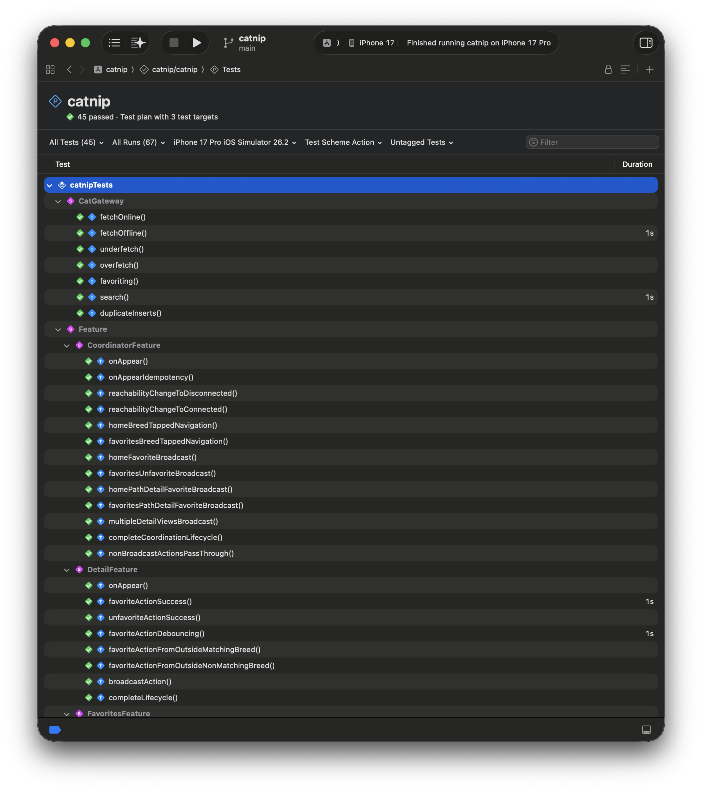
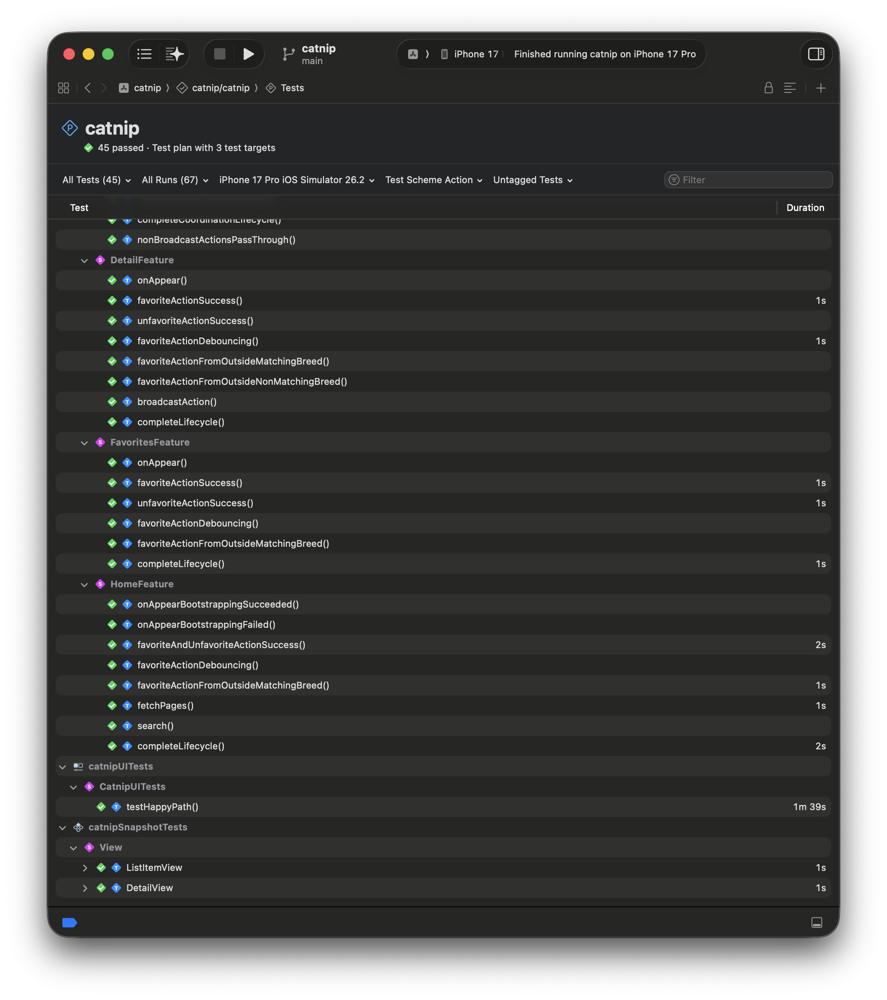

# Catnip

A SwiftUI iOS application for browsing cat breeds using [The Cat API](https://thecatapi.com/). Built with The Composable Architecture (TCA) and SwiftData for offline-first functionality.

## Overview

Catnip allows users to browse, search, and favorite cat breeds with full offline support. The app demonstrates modern iOS development practices including clean architecture, comprehensive testing, and modular design.

 https://github.com/user/repo/assets/12345/video.mp4
 
## Features

- **Browse Cat Breeds** - Infinite scrolling grid view with pagination
- **Search** - Real-time search with debouncing for optimal performance
- **Favorites Management** - Mark breeds as favorites with persistence across app launches
- **Detail View** - Comprehensive breed information including temperament, origin, description, and lifespan
- **Offline Support** - Full offline functionality with SwiftData
- **Network Awareness** - Visual feedback for network connectivity status
- **Image Caching** - Custom image cache for improved performance

## Architecture

### Clean Architecture + TCA

The project follows a clean architecture approach with clear separation of concerns:

```
┌─────────────────────────────────────────────┐
│           Presentation Layer (TCA)          │
│  ┌──────────┐  ┌──────────┐  ┌──────────┐   │
│  │   Home   │  │ Favorites│  │  Detail  │   │
│  │ Feature  │  │ Feature  │  │ Feature  │   │
│  └──────────┘  └──────────┘  └──────────┘   │
└─────────────────────────────────────────────┘
                     ↓
┌─────────────────────────────────────────────┐
│            Gateway Layer (App)              │
│          CatGateway (SwiftData)             │
│    Unified data source (API + Local DB)     │
└─────────────────────────────────────────────┘
                     ↓
┌─────────────────────────────────────────────┐
│          Domain Layer (CatsKit)             │
│   ┌───────────┐        ┌─────────────┐      │
│   │ Use Cases │   →    │ Repositories│      │
│   └───────────┘        └─────────────┘      │
└─────────────────────────────────────────────┘
                     ↓
┌─────────────────────────────────────────────┐
│        Service Layer (CatsKit)              │
│        API Integration + DTOs               │
└─────────────────────────────────────────────┘
                     ↓
┌─────────────────────────────────────────────┐
│    Infrastructure (HTTPNetworkService)      │
│         Generic HTTP Networking             │
└─────────────────────────────────────────────┘
```

### Key Architectural Decisions

#### 1. The Composable Architecture (TCA)

**Why TCA over traditional MVVM?**
- **Predictable State Management** - Single source of truth for each feature
- **Testability** - TCA's TestStore enables comprehensive unit testing of business logic
- **Composability** - Features can be composed and coordinated seamlessly
- **Side Effect Management** - Structured approach to async operations, debouncing, and cancellation
- **Cross-Feature Communication** - Broadcast actions for favorites synchronization across screens

#### 2. SwiftData for Offline Persistence

**Why SwiftData over CoreData?**
- **Modern Swift-first API** - Leverages Swift macros and modern concurrency
- **Less Boilerplate** - @Model macro reduces code compared to CoreData entities
- **Type Safety** - Strong typing with compile-time guarantees

**Offline Strategy:**
- **Listings: Offline-First Pattern** - Data is read from the local database as the primary source, with network requests happening only when needed
- **Search: Online-First Pattern** - Search queries hit the network whenever connectivity is available, falling back to cached results only when offline
- **Favorites Persistence** - Favorites are stored locally and sync across features
- **Pagination Metadata** - Current pagination state is persisted for seamless UX

#### 3. Modular Design with SPM Frameworks

**Framework Structure:**

1. **CatsKit** - Domain and service layer
   - `CatsKitDomain` - Pure business entities and use cases
   - `CatsKitDomainStaging` - Mock domain data for testing
   - `CatsKitService` - Cat API integration
   - `CatsKitServiceStaging` - Mock service responses

2. **HTTPNetworkService** - Generic HTTP networking
   - `HTTPNetworkService` - Protocol-based networking layer
   - `HTTPNetworkServiceStaging` - Mock networking for tests

**Benefits:**
- **Clear Boundaries** - Each framework has a single responsibility
- **Reusability** - HTTPNetworkService can be used in other projects
- **Testability** - Frameworks can be tested in isolation
- **Build Performance** - Modular compilation with caching
- **Dependency Clarity** - Explicit framework dependencies

#### 4. Gateway Pattern

The `CatGateway` acts as a unified data source that:
- Abstracts API and SwiftData complexity from features
- Handles online/offline scenarios transparently
- Prevents duplicate insertions with unique constraints
- Manages pagination metadata
- Syncs favorite status across all data sources
- Holds no state

## Key Implementation Strategies

### 1. Performance Optimizations

**Debouncing:**
- **Search** - 300ms debounce to avoid excessive API calls while typing
- **Favorites Toggle** - 500ms debounce to handle rapid user taps 

**Throttling:**
- **Pagination** - 1 second throttle prevents loading next page too rapidly during fast scrolling

**Image Caching:**
- Custom `ImageCache` using NSCache for memory management
- Automatic cache eviction on memory pressure

**Lazy Loading:**
- Pagination with infinite scroll
- Images load asynchronously without blocking UI

### 2. Network Reachability

**Implementation:** (`Reachability.swift`)
- Uses `Network.framework`'s `NWPathMonitor` for real-time network status
- `@Observable` class providing reactive network state
- Visual feedback via tab tint color (red when offline)
- Injected as dependency through TCA's `@Dependency` system

### 3. State Synchronization

**Challenge:** Keep favorites in sync across Home, Favorites, and Detail screens

**Solution:** TCA Broadcast Actions
```swift
    func handleDetailBroadcastFavoritedAction(breed: CatBreed,
                                              newDesiredState: Bool,
                                              state: inout State) -> Effect<Action> {

        // Send the event to:
        // * the home feature
        // * the favorite feature
        // * the home path's features and the favorite path's features
        return .merge(
            [.send(.home(.favoriteActionFromOutside(catBreed: breed))),
             .send(.favorites(.favoriteActionFromOutside(catBreed: breed,
                                                         newDesiredState: newDesiredState)))]
            + favoriteActionFromOutsideEffectsForAllPaths(state: &state,
                                                          breed: breed))
    }
```

This ensures consistent state across the entire app without manual coordination.

**Alternative Solution:** TCA @Shared property wrapper

Not a silver bullet, as it requires the Gateway to hold state, so trades complexity in one place to another.

### 4. Gateway SwiftData contexts

The gateway handles CRUD operations that are primarily main-actor-bound, so all gateway operations use a main context tied to the SwiftData ModelContainer. For any computationally expensive operations (bulk updates, complex queries, migrations), dedicated background contexts would be introduced to avoid blocking the main thread.

## Testing Strategy

### Unit Tests

**CatGateway Tests** (`CatGatewayTests.swift`)
- Online fetch scenarios
- Offline fetch from cache
- Pagination edge cases (underfetch, overfetch)
- Favorite/unfavorite persistence
- Search online and offline
- Duplicate insertion prevention

**TCA Feature Tests**
- Complete action/state cycle testing using `TestStore`
- Bootstrap success/failure scenarios
- Debouncing and throttling verification
- Pagination triggers
- Favorites synchronization
- Search functionality

**Framework Tests**
- `CatsKitDomainTests` - Use case behavior
- `CatsKitServiceTests` - API integration and DTO mapping
- `HTTPNetworkServiceTests` - Network layer

### UI Tests

**E2E Happy Path** (`catnipUITests.swift`)
- App launch and initial load
- Tab switching between Home and Favorites
- Scroll and pagination
- Search functionality
- Add/remove favorites
- Navigate to detail view
- Toggle favorite from detail

### Snapshot Tests

**Visual Regression Testing** (`catnipSnapshotTests/`)
- Ensures UI consistency across changes
- Documents expected visual appearance
- Snapshots generated for the **simulator iPhone 17 Pro iOS 26.2**

**Total Test Coverage:** ~2,233+ lines of test code, around 90% of app




## Project Structure

```
catnip/
├── catnip/catnip/catnip/              # Main app target
│   ├── App/
│   │   ├── catnipApp.swift            # Entry point, Core injection
│   │   └── Core.swift                 # Dependency container
│   ├── Coordinator/
│   │   ├── CoordinatorFeature.swift   # TCA navigation coordinator
│   │   └── CoordinatorView.swift      # Tab-based coordinator view
│   ├── Features/
│   │   ├── Home/                      # Browse/search feature
│   │   ├── Favorites/                 # Favorites list feature
│   │   └── Detail/                    # Breed detail feature
│   ├── Gateway/
│   │   └── CatGateway.swift           # SwiftData gateway
│   ├── Common/
│   │   ├── Extensions/                # Swift extensions
│   │   ├── Utilities/                 # ImageCache, Reachability
│   │   └── Views/                     # Shared UI components
│   └── Resources/
│       ├── Assets.xcassets            # Images and colors
│       └── Localizable.xcstrings      # Localization
├── Frameworks/
│   ├── CatsKit/                       # Domain + Service modules
│   └── HTTPNetworkService/            # Generic HTTP layer
└── Tests/
    ├── catnipTests/                   # Unit tests
    ├── catnipUITests/                 # E2E tests
    └── catnipSnapshotTests/           # Visual tests
```

## Technologies & Dependencies

### Core Technologies
- **SwiftUI** - Declarative UI framework
- **SwiftData** - Modern persistence framework
- **Combine** - Reactive state management
- **Swift Concurrency** - async/await for asynchronous operations

### External Dependencies
- **swift-composable-architecture** (1.17.2) - State management
- **swift-snapshot-testing** (1.18.3) - Snapshot tests

### API
- **The Cat API** - https://api.thecatapi.com/v1
- **Endpoints:**
  - `GET /breeds?limit={limit}&page={page}` - Paginated breeds
  - `GET /breeds/search?q={query}` - Search breeds

**Note:** API key is stored in Info.plist (reversed for basic obfuscation). In production, use environment variables or a secure backend.

## Use of AI

Claude Sonnet 4.5 was primarily used for the following tasks:

**Documentation Reference**
Quick lookups for API signatures, framework patterns, and best practices without context switching to external documentation.

**Code Snippet Generation**
Generating small, isolated code blocks for boilerplate, utility functions, or standard implementations.

**Code Review Assistance**
Reviewing code for potential issues, suggesting improvements, and validating architectural decisions.

**Why No "Vibe Coding"**
Full AI-driven code generation wasn't used, as it tends to be ineffective for structured problems and would be counterproductive in a code challenge where understanding the problem space and demonstrating intentional architectural choices is crucial.

## Possible Future Enhancements

- **Pull to Refresh** - Manual data refresh gesture
- **Advanced Filtering** - Filter by origin, temperament, characteristics
- **iPad Optimization** - Adaptive layouts for larger screens
- **Haptic Feedback** - Tactile feedback for interactions
- **Error Alerts** - User-facing error messages and retry options
- **Breed Comparison** - Side-by-side comparison of breeds

## Setup

### Requirements
- Xcode 26.2+
- iOS 26.2+
- Swift 5.9+

## License

This project was created as a coding challenge for Sword Health.

## Author

Diogo Balseiro - iOS Staff Engineer with +13 years of experience, based in Porto, Portugal.

---
